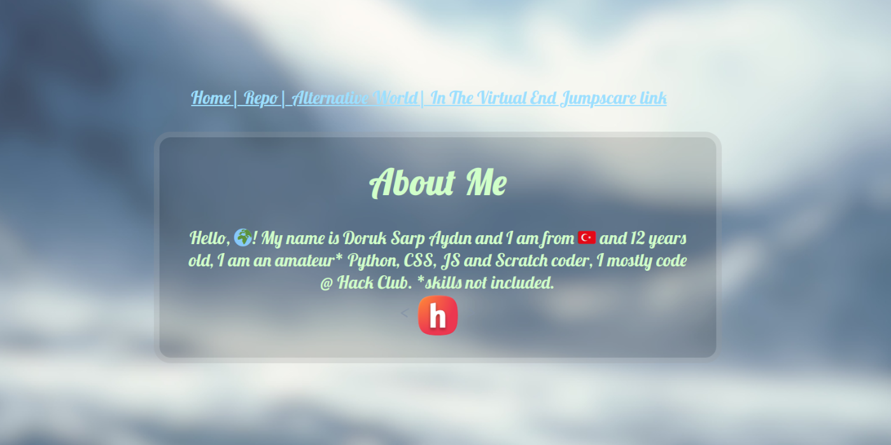
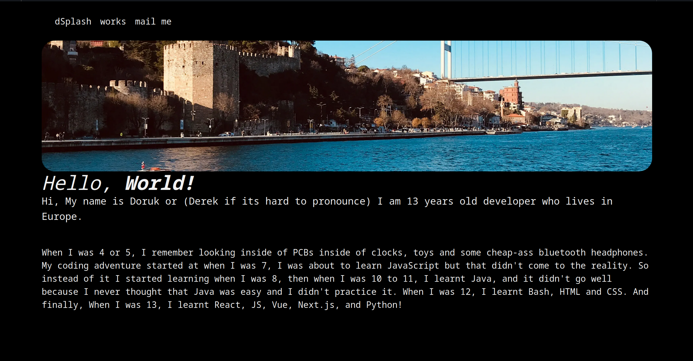
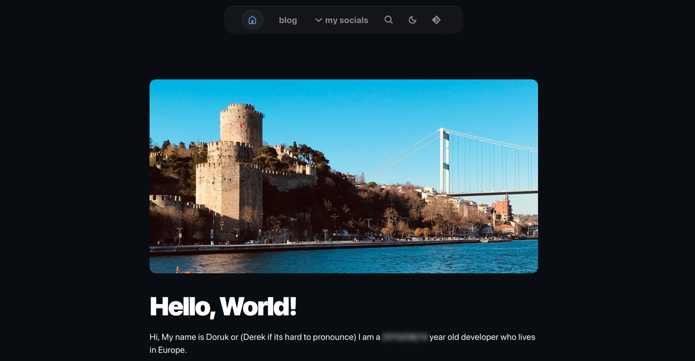

+++
authors = ["Doruk Sarp Aydın"]
title = "The evoution of my website: a journey through design and functionality"
description = "evolution of my website in short"
date = 2025-01-12
updated = "2024-01-12"
[taxonomies]
tags = ["Website"]
[extra]
banner = "banner.webp"
toc = true
toc_inline = true
toc_ordered = true
[extra.comments]
#
host = "vmst.io"
user = "doruk"
id = "113811800153174819"
#
# Thread with multiple images per post
#
# host = "mastodon.blaede.family"
# user = "cassidy"
# id = "112774854109302186"
#
# Thread with preview cards
# host = "mastodon.blaede.family"
# user = "cassidy"
# id = "110669429936617026"
#
# Post on GoToSocial
#
# host = "alpha.polymaths.social"
# user = "orbitalmartian"
# id = "01J7ETKJ19FGBDQGS1ZWZ3KEPP"
#
# Post on Sharkey
#
# host = "is-a.wyvern.rip"
# user = "volpeon"
# id = "9qy755nsnu2c0hbc"
#host = "vmst.io"
#user = "doruk"
#id = "113811800153174819"
+++

Creating a website is much like embarking on a journey; it evolves, adapts, and reflects the growth of its creator. As I sit down to write this blog post for the first time on my third website, I can’t help but reminisce about the evolution of my online presence. From my humble beginnings with a simple AI-generated design to the more sophisticated platform I have today, each iteration has taught me valuable lessons about aesthetics, user experience, and the importance of content.

## The First Website: A Bold Beginning

My journey began with my first website, a creation that was both exciting and experimental. Built using AI and HTML, it featured a striking background image of a mountain in Antarctica. The choice of this image was intentional; I wanted to convey a sense of adventure and exploration. The text was rendered in a vibrant light/neon green, which not only stood out against the icy backdrop but also gave the site a modern, tech-savvy feel. 

The content was housed in a container bubble, a design choice that added a playful touch to the overall aesthetic. While the site was far from perfect, it was a bold statement of my aspirations and creativity. It was a space where I could express myself and share my thoughts, albeit in a somewhat chaotic manner.

## The Second Website: A Lesson in Simplicity

After some time, I decided it was time for a change. My second website was a stark contrast to the first. I opted for a minimalist design, which, in hindsight, may have been a bit too simplistic. The monospaced font gave it a utilitarian feel, and the overall layout felt more like a digital resume than a personal website. I included a CV page, thinking it would be a great way to showcase my skills and experiences. However, the lack of personality and visual interest made it feel boring and uninspired.

This phase taught me an important lesson: while simplicity can be effective, it should not come at the cost of creativity and engagement. I realized that a website should not only serve as a portfolio but also as a reflection of who I am and what I stand for.

## The Third Website: A New Chapter

Now, as I write this blog post on my third website, I feel a renewed sense of purpose and excitement. This iteration combines the lessons learned from both previous versions. The design is vibrant and engaging, yet it maintains a level of professionalism that reflects my growth. I’ve incorporated elements that resonate with my personality, while also ensuring that the user experience is seamless and enjoyable.

This website is not just a platform for showcasing my work; it’s a space for storytelling, sharing ideas, and connecting with others. The blog section is a new addition, and I’m thrilled to finally be writing content that reflects my thoughts and experiences. I envision this blog as a place where I can explore various topics, share insights, and engage with my audience in meaningful ways.
